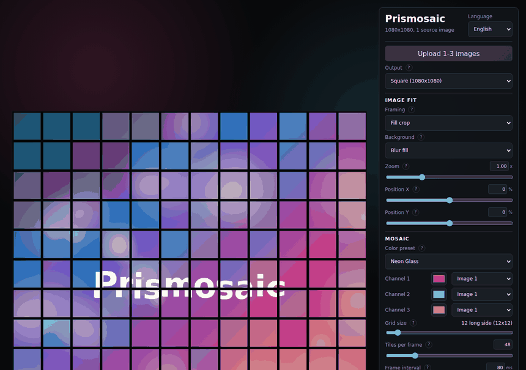

# Prismosaic

Prismosaic turns your photos into colorful tiled mosaics that can be saved as
still images, looping videos, or a small embeddable web package.

[](https://rob163.github.io/prismosaic/)

[Start creating in the live Prismosaic app](https://rob163.github.io/prismosaic/)

## How It Works

1. Upload one to three images.
2. Pick an output ratio for the canvas.
3. Tune the mosaic grid, color preset, animation speed, tile scale, and source jitter.
4. Download a still image, video loop, or embed ZIP.

Netlify deployment is also supported through the committed `netlify.toml`
configuration.

## What You Can Make

- Profile images, posters, thumbnails, and social posts in common export ratios.
- Short animated loops for reels, stories, and visual experiments.
- Color-shifted mosaics from one to three source images.
- Downloadable PNG, MP4/WebM, and embed ZIP outputs.

## Why It Is Useful

Prismosaic is designed for quick creative iteration:

- Upload images and see the mosaic update immediately.
- Switch between square, portrait, story, and landscape canvases.
- Tune grid size, animation speed, color strength, tile scale, and source jitter.
- Choose how source images fit the canvas before generating the mosaic.
- Export the result without sending photos to a server.

## Try It Locally

From this directory:

```bash
python3 -m http.server 8080
```

Then open:

```text
http://localhost:8080
```

To run the same static app through Netlify Dev:

```bash
netlify dev
```

Then open the local Netlify URL printed by the CLI.

From the parent repository:

```bash
.venv/bin/python -m http.server 8080
```

Then open:

```text
http://localhost:8080/prismosaic/
```

Use only one of those URL patterns. If the server is started from inside
`prismosaic/`, open `/`. If the server is started from the parent repository,
open `/prismosaic/`.

## Output Ratios

- Square: 1080 x 1080
- Portrait: 1080 x 1350
- Story/Reel: 1080 x 1920
- Landscape: 1920 x 1080

## Browser Support

PNG export works in modern browsers. Video export uses `MediaRecorder` and
`canvas.captureStream()`, so available MP4/WebM options depend on the browser.
Chromium-based browsers currently provide the most reliable video export
experience.
