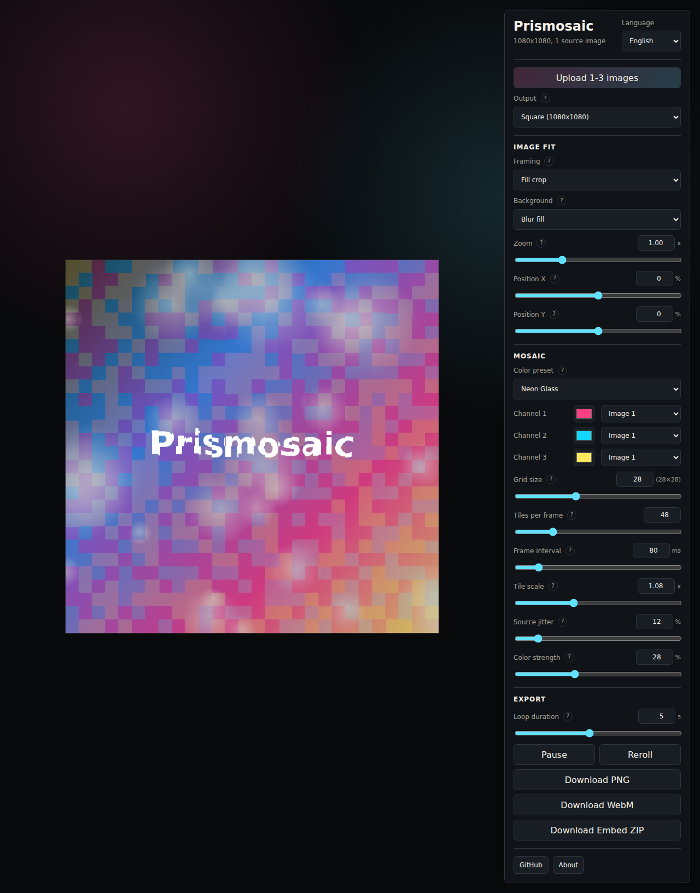

# Prismosaic

Prismosaic turns your photos into colorful tiled mosaics that can be saved as
still images, looping videos, or a small embeddable web package. It runs entirely
in the browser, so your images stay on your device.



## What You Can Make

- Profile images, posters, thumbnails, and social posts in common export ratios.
- Short animated loops for reels, stories, and visual experiments.
- Color-shifted mosaics from one to three source images.
- Downloadable PNG, WebM, and embed ZIP outputs.

## Why It Is Useful

Prismosaic is designed for quick creative iteration:

- Upload images and see the mosaic update immediately.
- Switch between square, portrait, story, and landscape canvases.
- Tune grid size, animation speed, color strength, tile scale, and source jitter.
- Choose how source images fit the canvas before generating the mosaic.
- Export the result without sending photos to a server.

## Privacy

- No backend.
- No image upload to a server.
- No build step required.

All image processing happens locally in the user's browser with Canvas.

## Try It Locally

From this directory:

```bash
python3 -m http.server 8080
```

Then open:

```text
http://localhost:8080
```

From the parent repository:

```bash
.venv/bin/python -m http.server 8080
```

Then open:

```text
http://localhost:8080/prismosaic/
```

Use only one of those URL patterns. If the server is started from inside
`prismosaic/`, open `/`. If the server is started from the parent repository,
open `/prismosaic/`.

## Output Ratios

- Square: 1080 x 1080
- Portrait: 1080 x 1350
- Story/Reel: 1080 x 1920
- Landscape: 1920 x 1080

## Browser Support

PNG export works in modern browsers. Video export uses `MediaRecorder` and
`canvas.captureStream()`, so available MP4/WebM options depend on the browser.
Chromium-based browsers currently provide the most reliable video export
experience.

## For Developers

The app is intentionally self-contained:

- Static HTML, CSS, and JavaScript.
- No backend service.
- No frontend build step.
- Automated syntax checks and Node tests.

## Publish on GitHub Pages

Prismosaic is ready to publish from this repository.

One-time repository setup:

1. In the repository settings, open **Pages**.
2. Set **Build and deployment** to **GitHub Actions**.
3. Push changes to the `main` branch, or manually run the included workflow at
   `.github/workflows/pages.yml`.

The workflow checks JavaScript syntax, runs the test suite, packages the runtime
static files, and deploys them to GitHub Pages.

The live demo URL will be:

```text
https://rob163.github.io/prismosaic/
```

This directory also includes `.nojekyll` so GitHub Pages serves the static files
directly without running Jekyll.

GitHub Pages must be available for the repository's current plan and visibility.
For example, Pages on private repositories requires a paid GitHub plan.

## Configuration

Most editable defaults live in:

```text
src/config.js
```

That file defines:

- `OUTPUT_PRESETS` — export canvas sizes.
- `COLOR_PRESETS` — color-deflection palettes.
- `DEFAULT_SETTINGS` — initial UI values.
- `CONTROL_CONFIG` — slider ranges and steps.

The web app does not depend on Python for image processing. Python is only used
as a convenient local static file server during development.
